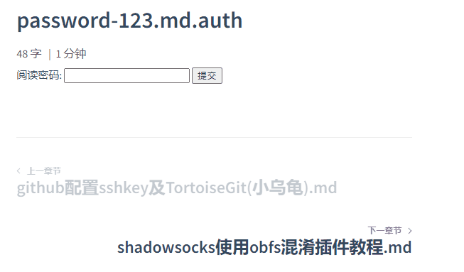

# encrypted-docsify-md-with-php

[简体中文](/README_CN.md)

Since docsify is a runtime library, I use php to process encrypted files for security reasons, otherwise encryption has no meaning.

## DEMO

Password: 123

[https://retrocode.io/#/%E6%8A%80%E5%B7%A7/password-123.md.auth](https://retrocode.io/#/%E6%8A%80%E5%B7%A7/password-123.md.auth)




## How to use

Append .password.auth to the suffix of the md file.

> filename.passwprd.auth.md

example:

> testPassword.123.auth.md

At the same time, please modify the file path in **_sidebar.md** to

> filename.md.auth

**remove the encrypted password (the encrypted password only exists in the source file)**

example:

````markdown

* category
    * [testPassword](category/testPassword.md.auth)

````

## Configure nginx pseudo-static to forward requests for encrypted files to auth.php

````yaml
location ~* \.(auth.md)$ {
  if (!-e $request_filename){
    rewrite ^(.*)$ /auth.php?s=$1 last; break;
  }
}
````

## Create auth.php and place it in the same directory as docsify's index.html

````php
<?php
function startWith($str, $needle) {
  return strpos($str, $needle) === 0;
}
function endWith($haystack, $needle) {
  $length = strlen($needle);
  if ($length == 0) {
    return true;
  }
  return (substr($haystack, -$length) === $needle);
}
function echoForm($requestUri) {
  echo <<<form
  <form action="$requestUri" onsubmit="location.reload();" target="nm_iframe" method='get'>
    Read password: <input type='text' name='auth'>
    <input type='submit' id="id_submit" value='submit'>
  </form>
  <iframe id="id_iframe" name="nm_iframe" style="display:none;"></iframe>
  form;
  exit;
}
$requestUri = urldecode($_SERVER['REQUEST_URI']);
$requestUri = parse_url($requestUri)['path'];
if (isset($_COOKIE['auth']) || isset($_GET['auth'])) {
  $cookieValue = $_COOKIE['auth'];
  if (isset($_GET['auth'])) {
    $cookieValue = md5($_GET['auth']);
    setcookie('auth', $cookieValue, time() + 3600 * 12);
  }
  $pathinfo = pathinfo($requestUri);
  $patharr = explode("/", $requestUri);
  $basename = str_replace(".auth.md", "", end($patharr));
  unset($patharr[count($patharr)-1]);
  $mdpath = __DIR__ . implode("/", $patharr);
  $files = scandir($mdpath);
  foreach ($files as $filename) {
    if (startWith($filename, $basename) && endWith($filename, '.auth.md')) {
      $password = str_replace($basename . ".", "", $filename);
      $password = str_replace(".auth.md", "", $password);
      if (md5($password) === $cookieValue) {
        echo $filecontent = file_get_contents($mdpath . "/" . $filename);
        exit;
      }
    }
  }
  echoForm($requestUri);
} else {
  echoForm($requestUri);
}
````

## Notice

If you use script to generate **_sidebar.md**, you need to process the file name when generating the **_sidebar.md** file.

example:

````php
    $files = scandir($path);
    foreach ($files as $filename) {
        $suffix = pathinfo($filename, PATHINFO_EXTENSION);
        if ($filename !== "." && $filename !== ".." && $suffix === "md") {
            // 删除加密MD文件中的密码
            if (endWith($filename, '.auth.md')) {
              $tmpfns = explode(".", $filename);
              unset($tmpfns[count($tmpfns)-3]);
              $filename = implode(".",$tmpfns);
            }
            $fileRealPath = $categoryName . "/" . $filename;
            file_put_contents($GLOBALS['sidebarPath'], "    * [" . $filename . "](" . $fileRealPath . ")\r\n", FILE_APPEND);
        }
    }
````
